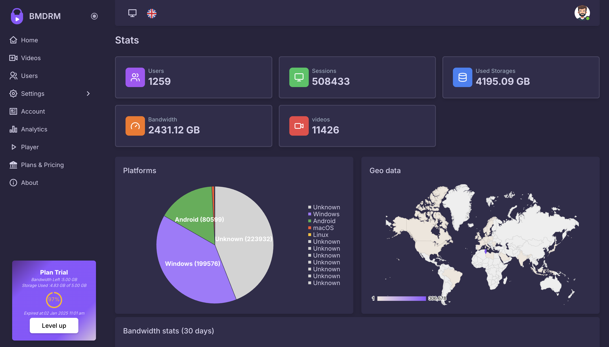
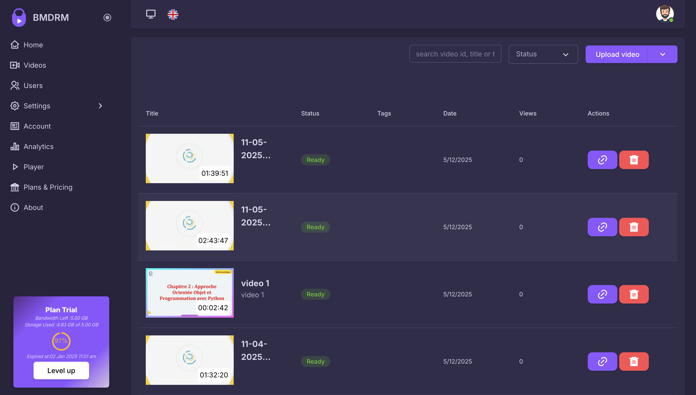

# BMDRM - Video Hosting Platform

<h1 align="center">BMDRM Video Hosting Platform</h1>
<p align="center">A modern, secure video hosting and management platform built with Next.js</p>

<p align="center">
  <a href="https://github.com/vercel/next.js/releases/tag/v14.2.7" alt="Next.js">
    
  </a>
  <a href="#">
    
  </a>
  <a href="#">
    
  </a>
  <a href="#">
    
  </a>
</p>


## 🚀 Overview

BMDRM is a comprehensive video hosting platform that provides secure, scalable video management solutions. Built with modern web technologies, it offers DRM protection, advanced analytics, and customizable video players for businesses and content creators.

## ✨ Key Features

### 🎥 Video Management
- **Secure Video Hosting** - Upload and manage videos with enterprise-grade security
- **DRM Protection** - Advanced digital rights management to protect your content
- **Custom Video Player** - Fully customizable player with brand integration
- **Scalable Storage** - From 50GB to 20TB+ storage options
- **Bandwidth Management** - Efficient content delivery with cost-effective bandwidth

### 📊 Analytics & Monitoring
- **Real-Time Analytics** - Track viewer engagement and performance metrics
- **Bandwidth Analytics** - Monitor and optimize bandwidth usage
- **Dashboard Overview** - Comprehensive dashboard for content management
- **Performance Insights** - Detailed reports on video performance

### 🔒 Security & Access Control
- **Controlled Access** - Secure links and permission-based viewing
- **User Management** - Multi-user access with role-based permissions
- **API Integration** - Upload API for seamless content integration
- **Enterprise Security** - Advanced security features for business needs

### 💼 Business Features
- **Multiple Pricing Tiers** - 9 different plans from Lite to Enterprise
- **Custom Solutions** - Tailored enterprise solutions
- **Dedicated Support** - Professional support for enterprise clients
- **Scalable Infrastructure** - Grows with your business needs

## 🛠️ Technologies Used

### Frontend
- **Next.js 14.2.7** - React framework for production
- **React 18.3.1** - Modern React with latest features
- **Tailwind CSS 3.4.10** - Utility-first CSS framework
- **GSAP 3.12.5** - Professional-grade animations
- **Swiper 8.4.5** - Modern touch slider

### UI/UX
- **Feather Icons** - Beautiful open source icons
- **React Icons** - Popular icon library
- **Responsive Design** - Mobile-first approach
- **Modern Animations** - Smooth GSAP-powered animations

### Content Management
- **MDX Support** - Enhanced markdown with React components
- **Gray Matter** - Front matter parser
- **Marked** - Markdown parser and compiler
- **Syntax Highlighting** - Code syntax highlighting support

### Development Tools
- **ESLint** - Code linting and formatting
- **Prettier** - Code formatting
- **PostCSS** - CSS processing
- **Sass** - CSS preprocessor

## 📱 Pages & Features

### 🏠 **Home Page**
- Hero section with platform overview
- Interactive features showcase
- Client testimonials
- Call-to-action sections

### 📊 **Dashboard**

*Monitor your video library and viewer activity with comprehensive analytics*

### 📈 **Analytics**

*Track bandwidth usage and optimize content delivery costs*

### 🎬 **Video Management**

*Manage your entire video library with detailed statistics and controls*

### 💰 **Pricing Plans**

*Flexible pricing options from individual creators to enterprise solutions*

### 🔔 **Notifications**

*Stay updated with real-time notifications and alerts*

### 📊 **Real-time Analytics**

*Monitor live performance metrics and viewer engagement*

### 📄 **Additional Pages**
- **About** - Company information and mission
- **Contact** - Get in touch with support
- **Blog** - Latest news and updates
- **Terms & Privacy** - Legal information
- **Elements** - UI component showcase

## 💰 Pricing Tiers

| Plan | Price | Storage | Bandwidth | Best For |
|------|-------|---------|-----------|----------|
| **Lite** | $40/3mo | 50GB | 200GB | Individuals |
| **Starter** | $120/year | 100GB | 1TB | Small teams |
| **Value** | $320/year | 200GB | 2.5TB | Growing businesses |
| **Express** | $560/year | 400GB | 5TB | Medium businesses |
| **Pro** | $1,280/year | 1TB | 15TB | Large organizations |
| **Plus** | $2,400/year | 1.2TB | 30TB | Enterprise |
| **Premium** | $4,000/year | 2TB | 50TB | Large enterprise |
| **Supreme** | $20,800/year | 20TB | 500TB | Enterprise scale |
| **Custom** | Contact Us | Custom | Custom | Enterprise solutions |

## 🚀 Quick Start

### Prerequisites
- **Node.js** (LTS version recommended)
- **npm** or **yarn** package manager

### Installation

1. **Clone the repository**
```bash
git clone <repository-url>
cd template-bmdrm
```

2. **Install dependencies**
```bash
npm install
```

3. **Run development server**
```bash
npm run dev
```

4. **Open your browser**
```bash
http://localhost:3000
```


### Build for Production

```bash
npm run build
npm start
```

## 📁 Project Structure

├── app/                    # Next.js app directory
│   ├── pricing/           # Pricing page
│   ├── posts/             # Blog posts
│   └── page.js            # Home page
├── components/            # Reusable components
├── content/               # Markdown content
├── layouts/               # Page layouts
│   ├── components/        # Layout components
│   └── partials/          # Partial components
├── lib/                   # Utility functions
├── public/                # Static assets
│   ├── images/            # Images and screenshots
│   └── icons/             # Icon assets
├── styles/                # SCSS stylesheets
└── config/                # Configuration files


## 🎨 Customization

### Theme Configuration
Customize colors, fonts, and other design tokens in:
- `config/theme.json` - Theme colors and settings
- `tailwind.config.js` - Tailwind CSS configuration
- `styles/` - Custom SCSS styles

### Content Management
- Edit content in `content/` directory
- Modify page layouts in `layouts/`
- Update configuration in `config/`

## 🤝 Contributing

1. Fork the repository
2. Create your feature branch (`git checkout -b feature/AmazingFeature`)
3. Commit your changes (`git commit -m 'Add some AmazingFeature'`)
4. Push to the branch (`git push origin feature/AmazingFeature`)
5. Open a Pull Request

## 📄 License

This project is licensed under the MIT License - see the [LICENSE](LICENSE) file for details.

## 🆘 Support

For technical support or questions:
- 📧 Email: support@bmdrm.com
- 💬 Live Chat: Available on our website
- 📖 Documentation: [docs.bmdrm.com](https://docs.bmdrm.com)

## 🌟 Features in Development

- [ ] Mobile app for iOS and Android
- [ ] Advanced AI-powered analytics
- [ ] Live streaming capabilities
- [ ] Enhanced API documentation
- [ ] Multi-language support

---

<p align="center">Made with ❤️ for content creators and businesses worldwide</p>